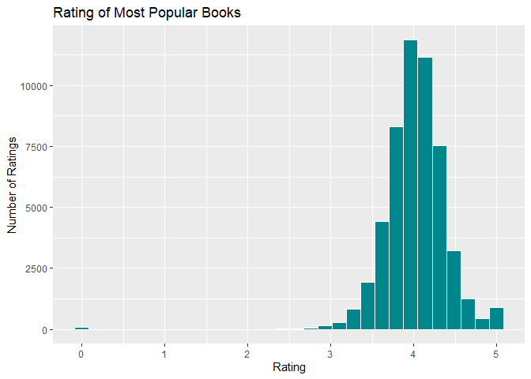

The Best Books
================

## Assignment: GitHub Documents

This is an R Markdown format used for publishing markdown documents to
GitHub. When you click the **Knit** button all R code chunks are run and
a markdown file (.md) suitable for publishing to GitHub is generated.

## Code

``` r
library(tidyverse)

best_books <- read.csv("Best_Books_Ever.csv")
```

## Plot

<!-- -->

Books and ratings were chosen from the GoodReads best books list.[1]

[1] Tiwari, S. (2021) Best Book to Read in 2021 (Version 1) \[Data
Set\]. kaggle.
<https://www.kaggle.com/shashwatwork/best-book-ever-data-for-2021/version/1>
